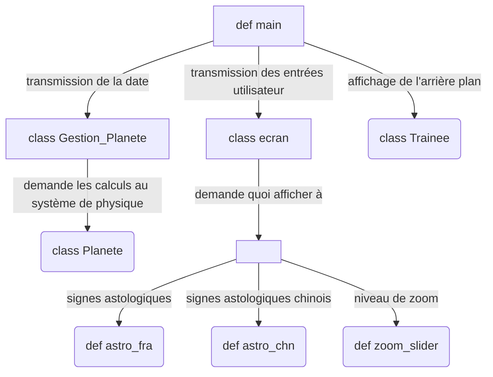

# solar-system
 Simulateur de Système Solaire

```mermaid
flowchart TD
    A[def main] -- transmission des entrées utilisateur --> B[class ecran];
    A -- transmission de la date --> C[class Gestion_Planete];
    C -- demande les calculs au système de physique --> D(class Planete);
    B -- demande quoi afficher à --> E[ ];
    E -- signes astologiques --> F(def astro_fra);
    E -- signes astologiques chinois --> G(def astro_chn);
    E -- niveau de zoom --> H(def zoom_slider);
    A -- affichage de l'arrière plan --> I(class Trainee);
```
